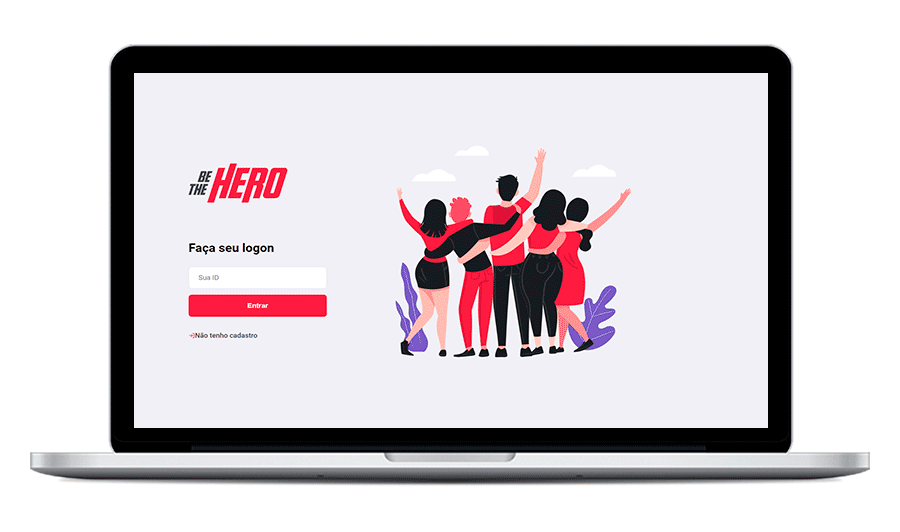

<div align="center">
	
	<br>
	<br>
  
  
<a href="#about"></a
</div>

[💡 Sobre o projeto](#about)
<br>
[🛸 Tecnologias](#techs)
<br>
[🧪 Minhas alterações](#my-changes)
<br>
[⚙️ Como utilizar](#quick-start)
<br>
[🧩 Variáveis de ambiente](#vars)
<br>
[🤖 Scripts](#scripts)
<br>
[🖖🏻 Como contribuir](#contribute)
<br>
[📝 License](#license)

<div id='about'/>  
# 💡 Sobre o projeto

Be The Hero é uma plataforma para aproximar ONGs de pessoas que estão dispostas a fazer o bem e contribuir financeiramente para a solução de casos.

Desenvolvido durante a **Semana OmniStack 11.0**, créditos a [Rocketseat 🚀
](https://github.com/Rocketseat)
<div id='techs'/>  
# 🛸 Tecnologias

* Node.js

* React

* React Native

* Expo

  
<div id='my-changes'/>  
# 🧪 Minhas alterações

...


<div id='quick-start'/>  
# ⚙️ Como utilizar

Clone o repositório:

```
git clone https://github.com/ViniciusMazon/semana-omniStack-11.git
```

Instale as dependências:

📁./backend

```
npm install
```

📁./frontend

```
npm install
```
📁./mobile

```
npm install
```
ou

📁./backend

```
yarn install
```
📁./frontend

```
yarn install
```
📁./mobile

```
yarn install
```


**Desenvolvimento**

**Backend:**

```
npm run dev
```

ou

```
yarn dev
```

**Frontend:**

```
npm run dev
```

ou

```
yarn dev
```

Mobile:

```
npm run dev
```

ou

```
yarn dev
```


 **Produção**

...

 **Teste**

**Backend**:

```
npm run test
```

ou

```
yarn test
```


<div id='vars'/> 
# 🧩 Variáveis de ambiente

**Backend**

- `PORT`: Selecione a porta em que deseja rodar a API

<div id='scripts'/> 
# 🤖 Scripts

**Backend:**

- `dev`: Roda a aplicação em modo de desenvolvimento
- `start`: Roda a aplicação com o script de produção

**Frontend:**

- `start`: Roda a aplicação

**Mobile:**

- `start`: Roda a aplicação

<div id='contribute'/> 
# 🖖🏻 Como contribuir

- Faça um fork desse repositório;
- Clone esse repositório em sua máquina: `https://github.com/ViniciusMazon/semana-omniStack-11.git`
- Cria uma branch com a sua feature: `git checkout -b minha-feature`;
- Faça commit das suas alterações: `git commit -m 'feat: Minha nova feature'`;
- Faça push para a sua branch: `git push origin minha-feature`.

Depois que o merge da sua pull request for feito, você pode deletar a sua branch.


<div id='license'/> 
# 📝 License

Esse projeto está sob a licença MIT. Veja o arquivo [LICENSE](#) para mais detalhes.

